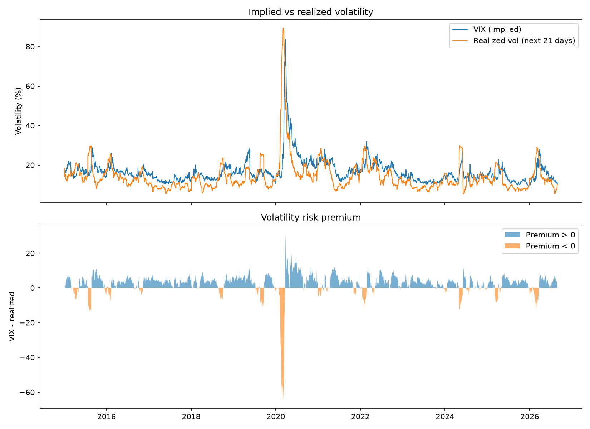

# Volatility Risk Premium: India VIX vs Realised Nifty Volatility

An empirical study of whether the market's expected volatility (India VIX) is usually higher than the volatility that Nifty 50 actually realises afterwards.

## Motivation
Option prices depend on expected volatility, so I wanted to check on real Indian market data whether the market's expectation is usually higher than what actually happens.

## Method
- **Data:** daily Nifty 50 closes and India VIX levels, downloaded with `yfinance`
- **Returns:** daily log returns, `r_t = ln(P_t / P_(t-1))`
- **Realised volatility:** standard deviation of daily returns over the next 21 trading days, annualised with `sqrt(252)` and expressed in percent
- **Premium:** `VIX - realised volatility`. A positive value means implied volatility was higher than what materialised.

## Results
Sample: 2,852 trading days.

- Average VIX: 16.59
- Average realised volatility: 14.12
- Average premium: 2.46 volatility points
- Median premium: 3.25
- Premium positive on 79.7% of days
- 5th percentile premium: -6.34
- Worst premium: -64.50 (on 2020-03-05, at the start of the COVID crash)



Implied volatility was above realised volatility on most days, which is consistent with the well-known volatility risk premium. The median is higher than the mean, so the premium is skewed: small gains on most days and rare, very large losses in crashes.

## How to run
```
pip install numpy pandas matplotlib yfinance
python vrp_study.py
```
The script prints the statistics above and saves `vrp_results.png`. If `yfinance` does not work, place `nifty.csv` and `vix.csv` (columns `Date, Close`) in the same folder.

## Limitations
- VIX is a 30 calendar day estimate, and I used 21 trading days as an approximation
- This measures the gap only. It is not a trading strategy, and it ignores costs, margin and position sizing.
- A high average premium does not remove crash risk, as the worst period shows